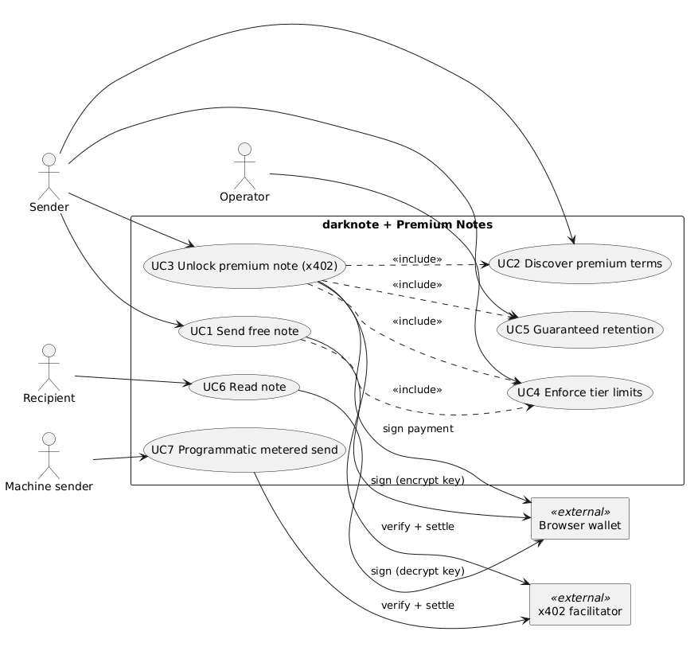
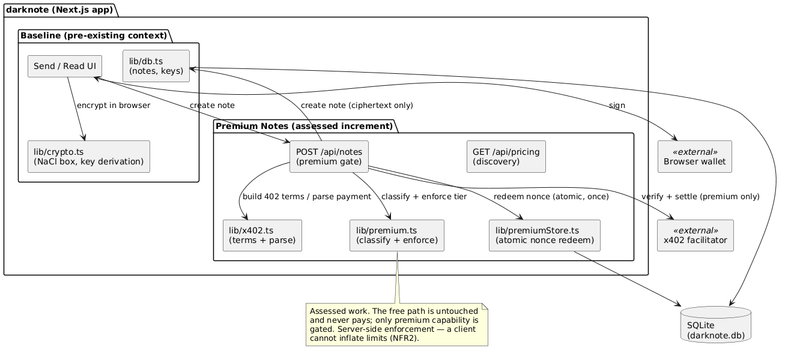
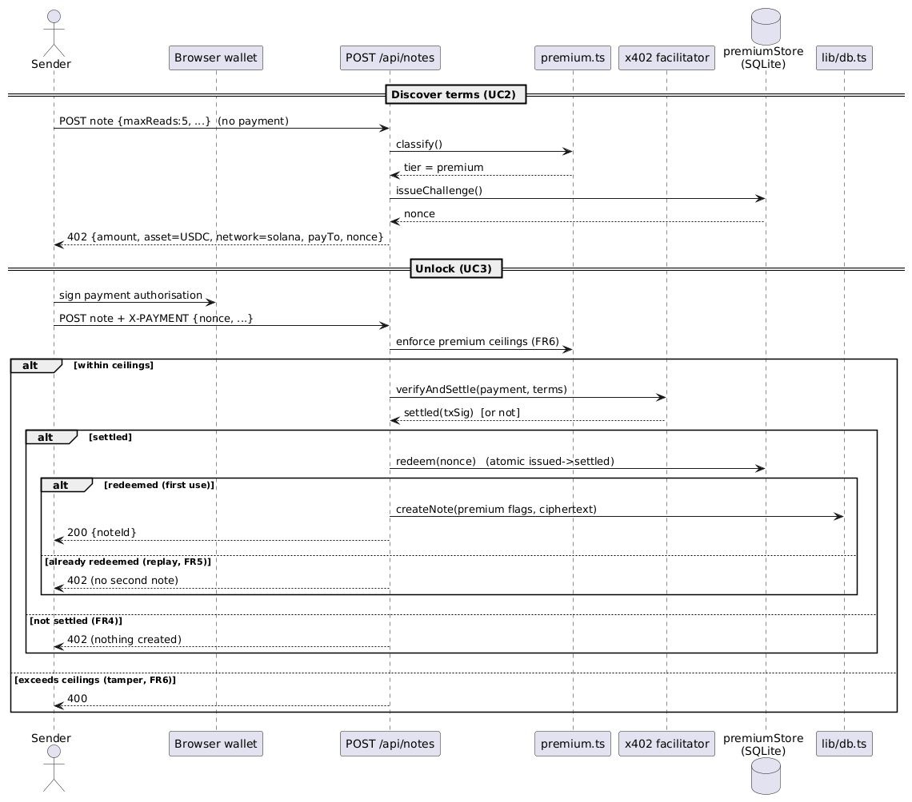

# Monetising an End-to-End Encrypted Messaging dApp Without Eroding Privacy: An x402-Gated Premium Tier for darknote

**UFCFFF-30-3 Software Development Project — Project Report**
*Word count target: ~6,000 (all-inclusive per UWE Assessment Content Limit Policy)*

> **How to use this draft.** This is a structured model, not a submission. Every section maps to a marking criterion; rewrite each paragraph in your own words before submitting, because the brief bars copying machine-generated text and runs text-matching. Replace every `[SCREENSHOT]`/`[FIGURE]` marker with a real captured image, and read each cited source yourself so you can defend it. Citations are UWE-Harvard; verify page numbers and the two arXiv author lists flagged in the reference notes.

---

## Abstract

darknote is an end-to-end encrypted messaging application that encrypts each note in the sender's browser with NaCl `crypto_box` — X25519 (Curve25519) key agreement, the XSalsa20 stream cipher and the Poly1305 authenticator — and addresses it to a Solana wallet, so that the server stores only ciphertext, a nonce and an ephemeral public key and holds no key with which to decrypt. ("Zero-knowledge" is used later only in the precise sense that the *server* has zero knowledge of plaintext, not in the sense of zero-knowledge proofs, which the system does not use.) This project extends that pre-existing application with a new feature: an x402-gated *premium tier* that monetises high-cost capabilities (multi-read notes, large payloads, guaranteed retention) through per-note micropayments settled on-chain, while leaving ordinary notes free and frictionless. The work is motivated by two problems evidenced in the literature — the abuse economics of free, unlimited ephemeral messaging, and the incompatibility of conventional monetisation (advertising, accounts) with a privacy proposition. Requirements were derived from user scenarios and captured as use cases and a MoSCoW-prioritised requirements specification. The feature was built test-first inside the existing Next.js codebase; the security-critical core — server-side tier enforcement, facilitator-verified settlement, and atomic replay-safe nonce redemption — is covered by 25 automated tests with full traceability to requirements, and the design directly answers replay and authorisation weaknesses reported in the recent x402 security literature. The report reflects critically on the decision to keep payment off the latency-insensitive path, on building on a personal codebase with a disciplined provenance boundary, and on the suitability of the tools and methodology under a hard timebox.

---

## 1. Introduction

### 1.1 Context

Private communication over public infrastructure is a long-standing problem in computer security. End-to-end encryption (E2EE) has moved from a specialist concern to a mainstream expectation, and its formal foundations are now well understood: the Signal protocol, which underpins much of modern secure messaging, has been given a formal security analysis establishing confidentiality and authentication guarantees for its key-agreement and ratcheting constructions (Cohn-Gordon et al., 2017). The cryptographic primitives that make lightweight E2EE practical — notably Curve25519 elliptic-curve Diffie–Hellman (Bernstein, 2006) packaged in the NaCl library (Bernstein, Lange and Schwabe, 2012) — are exactly those on which the application in this project is built.

darknote (deployed as *DarkNote*) is a pre-existing application, authored by the student before this assessment, that lets a user send an encrypted note to any Solana wallet address. Encryption is performed in the browser with NaCl's `box` construction (X25519 key agreement with the XSalsa20–Poly1305 authenticated cipher); the recipient's encryption keypair is derived deterministically from a wallet signature so that only the wallet owner can decrypt; and the server persists only ciphertext, a nonce and an ephemeral public key. The server therefore *cannot* read messages — a genuine end-to-end (zero-access) posture rather than a policy promise. The exact construction as implemented is set out in Section 2.5.

### 1.2 The problem this project addresses

A privacy tool has an awkward relationship with money. Its most powerful capabilities are also its most abusable: in darknote's case, the note-creation endpoint historically accepted multi-read notes, payloads up to 100 KB, and long-lived retention with no cost and no friction. Two literatures make the risk concrete. First, the economics of unsolicited and abusive messaging show that cost-free capability is exploited at scale precisely because the marginal cost of sending is effectively zero (Kanich et al., 2008); introducing even a small per-message cost changes the economics of abuse. Second, the conventional monetisation levers — advertising and account-based subscriptions — are precisely the mechanisms that erode privacy, because they depend on identity and behavioural data. A privacy product that funds itself by harvesting data undermines its own proposition.

The feature developed in this project resolves the tension using **x402**, an open protocol that revives the HTTP 402 *Payment Required* status code to enable web-native micropayments settled on-chain in stablecoins (Coinbase, 2025). A premium note is unlocked by a small, verified payment; ordinary notes remain free. Payment introduces friction exactly where abuse lives, and creates revenue without accounts, advertising or tracking.

### 1.3 Aim and objectives

**Aim:** to design, build and evaluate a premium-capability tier for darknote that is monetised through on-chain micropayments without weakening the application's privacy properties.

**Objectives:**
1. Derive requirements from user scenarios and the research literature, captured as use cases and a requirements specification.
2. Critically evaluate the available technology options (payment mechanism, metering model, enforcement placement) and the risks involved.
3. Implement the feature test-first, with the security-critical logic (payment verification, replay protection, tier enforcement) covered by automated tests traceable to requirements.
4. Evaluate the artefact against its requirements and reflect on the process, tools and methodology.

### 1.4 Scope and provenance

The **assessed artefact** is the new *Premium Notes* feature: tier classification, x402 unlock on note creation, replay-safe settlement, server-side enforcement, guaranteed retention and pricing discovery. The pre-existing darknote application — its cryptography, key derivation, storage and reader interface — is treated as documented context and is explicitly out of assessed scope. This boundary is made concrete in version control: the repository's first commit (`v-baseline`) captures the pristine prior application, and every subsequent commit implements the assessed increment. This mirrors the sanctioned pattern of extending an existing project with a delimited feature, and it keeps the authorship line unambiguous. Generative AI was used in an assistive role for drafting and structuring, and is acknowledged here in accordance with the module's policy.

### 1.5 Report structure

Section 2 reviews the relevant research and evaluates the technology options. Section 3 derives the requirements. Section 4 sets out the methodology, version control, quality, risk and ethics. Section 5 presents the design and implementation. Section 6 reports testing and evaluation results. Section 7 concludes with critical reflection.

---

## 2. Research and technology evaluation

### 2.1 End-to-end encryption and the limits of confidentiality

E2EE guarantees message *confidentiality*, but the research literature is emphatic that confidentiality is not the same as privacy. A recurring finding is that metadata — who communicates with whom, when, and how often — frequently reveals as much as content, and is not protected by encrypting the payload alone (Jefferys, Shishmarev and Harman, 2020; Kwon, Lu and Devadas, 2019). This matters for the present design in two ways. First, it clarifies what darknote does and does not claim: it protects content perfectly (the server cannot decrypt) but, like most practical systems, does not fully hide metadata such as recipient address and timing. Second, it disciplines the new feature — the premium tier must not weaken confidentiality or introduce new metadata linkages between payment and plaintext. The design honours this: the server never sees plaintext (there is none to see), and a payment is bound only to an opaque note record, not to message content.

The cryptographic substrate is mature and well-analysed. NaCl's design goal was to remove the foot-guns that cause real-world cryptographic failures by offering a small, misuse-resistant high-level interface (Bernstein, Lange and Schwabe, 2012), built on Curve25519 (Bernstein, 2006). The wider messaging-security literature also warns that composition is where systems fail: Rösler, Mainka and Schwenk (2018) show that even Signal-based group messaging had end-to-end weaknesses arising from protocol composition rather than primitive weakness. The lesson taken into this project is that the *new* code — not the well-tested primitives — is the likely source of defects, and so testing effort is concentrated on the new payment and enforcement logic.

### 2.2 The economics of abuse and the case for cost

The rationale for a paid tier is not only commercial. Empirical work on spam demonstrates that abusive messaging is a rational response to near-zero marginal cost: Kanich et al. (2008) instrumented a live spam campaign and measured conversion rates on the order of 1 in 10 million, profitable only because sending is essentially free. The corollary, widely drawn in anti-abuse design, is that attaching even a small cost to a high-value action disproportionately deters bulk abuse while barely affecting legitimate users. darknote's unmetered multi-read, large-payload and long-retention capabilities are the analogue of "free sending" for a storage-backed service; pricing them is an abuse control as much as a revenue model.

### 2.3 Micropayments and on-chain settlement

Micropayments have a long research history. Rivest and Shamir (1997) proposed PayWord and MicroMint precisely because per-transaction overheads made small payments uneconomic on conventional rails — a problem that dominated the field for two decades. On-chain settlement in low-fee stablecoins changes this calculus: a public ledger provides final settlement without a trusted intermediary (Nakamoto, 2008), and modern low-fee networks make sub-dollar payments viable. x402 operationalises this for the web: an unpaid request returns `402` with machine-readable terms; the client signs a stablecoin transfer and retries with a payment header; a facilitator verifies and settles (Coinbase, 2025). Crucially for this project's threat model, x402 is *account-less* — the payer needs no login — which aligns with darknote's "no accounts, no PII" stance in a way that card processors and subscriptions cannot.

x402 is new, and its security is an active research topic. Li, Wang and Wang (2026) identify five practical attacks on x402 deployments, spanning authorisation, payment-to-resource binding, and **replay** protection, and demonstrate that weak binding or missing replay defence leads to "unpaid service or paid-but-denied outcomes." This is directly formative for the design: the premium gate treats facilitator verification as necessary but not sufficient, and adds its own atomic, single-use nonce redemption so that a replayed or unbound settlement can never unlock a second note (Section 5.4). The research therefore does not merely motivate the feature; it shapes a specific, testable security requirement.

### 2.4 Technology options and selection

Selections were made using weighted Pugh matrices; criteria weights reflect the project's priorities (privacy alignment and security correctness weighted highest, delivery risk next, given the timebox).

**Decision 1 — Payment mechanism.** Options: x402; verifying a raw on-chain SOL transfer; a card processor (Stripe); L402 (Lightning). Criteria and weighted scores (1–5):

| Criterion (weight) | x402 | Raw transfer | Stripe | L402 |
|---|---|---|---|---|
| Privacy/no-account alignment (5) | 5 | 5 | 1 | 4 |
| Settlement finality & speed (4) | 4 | 4 | 3 | 4 |
| Implementation effort in timebox (4) | 4 | 2 | 3 | 2 |
| Standard, machine-readable terms (3) | 5 | 1 | 4 | 3 |
| **Weighted total** | **73** | **51** | **43** | **55** |

x402 wins on account-less alignment and standardised terms; raw-transfer verification effectively reinvents a fragile facilitator; Stripe reintroduces accounts and KYC, defeating the privacy premise; L402 requires Lightning infrastructure the project cannot justify in the timebox.

**Decision 2 — Metering model.** Options: per-request payment; prepaid credits; subscription. Sending a note is *not* latency-critical, so the native per-request x402 model incurs no meaningful cost, whereas in a latency-critical domain one would amortise payment into prepaid credits to keep the hot path clean. Subscriptions reintroduce accounts. **Per-request** is selected; the contrast with latency-critical amortisation is itself a reflective point (Section 7).

**Decision 3 — Enforcement placement.** Options: client-side gating; server-side enforcement. A control a client can bypass is not a control; server-side enforcement is mandatory for both abuse-resistance and payment integrity. **Server-side** is selected.

**Decision 4 — Settlement store.** The application already uses SQLite via better-sqlite3, whose synchronous transactions provide the atomicity needed for replay-safe redemption without new infrastructure. Reuse is selected over an external datastore on grounds of both risk and portability.

### 2.5 Privacy architecture (as implemented)

To remove any ambiguity, this subsection states the exact scheme the artefact uses. Each note is encrypted entirely in the sender's browser using NaCl `crypto_box`, in the TweetNaCl JavaScript implementation. `crypto_box` is a public-key *authenticated* encryption scheme built from three primitives: **X25519** — Elliptic-Curve Diffie–Hellman key agreement on Curve25519 (Diffie and Hellman, 1976; Bernstein, 2006) — which establishes a shared secret; the **XSalsa20** stream cipher (Bernstein, 2008) for confidentiality; and the **Poly1305** one-time message-authentication code (Bernstein, 2005) for integrity, giving authenticated encryption in the sense of Bellare and Namprempre (2000). To send a note the client generates a **fresh ephemeral X25519 keypair** and a random 24-byte nonce, computes the shared secret from the ephemeral secret key and the recipient's public key, encrypts the payload, and stores only the ciphertext, the nonce and the **ephemeral public key** (base64-encoded) alongside the recipient's address. Because a new ephemeral keypair is used for every note, the scheme provides forward secrecy on the sender side. This ephemeral-sender / static-recipient construction is precisely the DHIES/ECIES integrated-encryption pattern (Abdalla, Bellare and Rogaway, 2001), instantiated with X25519 (specified as a standard in RFC 7748; Langley, Hamburg and Turner, 2016), XSalsa20 and Poly1305. The recipient's X25519 keypair is **not** their Solana signing key: the wallet is asked to sign the fixed string `"DarkNote encryption key for <address>"`, the resulting Ed25519 signature is hashed with SHA-512 (NaCl `hash`), and the first 32 bytes are used as the X25519 secret key — so the same wallet deterministically reproduces the same encryption key while the wallet's private key is never exposed to the application. The server persists only ciphertext, nonce, ephemeral public key and recipient address, and holds no decryption key; it therefore cannot read any note. **This is the precise sense in which the system is "zero-knowledge": the *server* has zero knowledge of plaintext — an end-to-end / zero-access encryption architecture — which is distinct from zero-knowledge *proofs* (Goldwasser, Micali and Rackoff, 1989), a technique the system does not use.**

---

## 3. Requirements

### 3.1 User scenarios

Requirements were derived from four scenarios, following the scenario-to-use-case practice recommended by Cockburn (2001):

- **S1 — Privacy-first sender (free).** Sends a one-time secret; wants exactly today's free behaviour with no added friction.
- **S2 — Sender needing persistence (premium).** Sends instructions a colleague must read on several devices over a month; will pay a few cents but refuses an account or card.
- **S3 — Abuse-conscious operator.** Wants unmetered high-cost capability to stop being free, while keeping ordinary notes free.
- **S4 — Machine sender (stretch).** An application wants to send encrypted notifications programmatically and pay per message with no signup.

### 3.2 Use cases

The scenarios yield seven use cases (full diagram: `docs/diagrams/use-cases.puml`, shown in Figure 1): UC1 send free note; UC2 discover premium terms; UC3 unlock premium note (x402); UC4 enforce tier limits; UC5 guaranteed retention; UC6 read note (existing behaviour, context); UC7 programmatic metered send (stretch). UC3's main flow — compose → server returns `402` with terms and a nonce → wallet signs → retry with payment → verify → atomic redeem → create — is the backbone of the feature and is realised directly in the sequence diagram of Section 5.

*Figure 1 — Use cases and actors: Sender, Operator, Recipient and Machine-sender against the darknote + Premium Notes boundary, with the external browser wallet and x402 facilitator.*

### 3.3 Functional requirements (MoSCoW)

Fifteen functional requirements were specified; the *Must* set defines the assessable core. Representative examples:

- **FR1 (M):** classify a request as free or premium from its requested capabilities.
- **FR3 (M):** an unpaid premium request returns `402` with machine-readable x402 terms.
- **FR4 (M):** premium capability is honoured only after facilitator-verified settlement.
- **FR5 (M):** one settlement unlocks exactly one premium note (replay-safe).
- **FR6 (M):** tier ceilings are enforced server-side regardless of client input.
- **FR7 (M):** premium notes are exempt from free-note cleanup (guaranteed retention).
- **FR9 (M):** failures never leak internal detail.

The full table, with priorities and use-case links, is maintained in the SRS and the traceability matrix.

### 3.4 Non-functional requirements

NFRs were organised by the ISO/IEC 25010 product-quality model (ISO/IEC, 2011). The security-relevant ones dominate: *payment integrity* (capability granted only on verified, non-replayable settlement), *tamper resistance* (ceilings hold against a hostile client), and *reliability* (atomic, consistent redemption under concurrency). *Efficiency* is captured as a discriminating requirement — payment must not touch the free path — and *maintainability* requires the facilitator to sit behind an interface and the new modules to reach ≥80% line coverage.

---

## 4. Methodology, version control, quality and ethics

### 4.1 Development methodology

The project used a solo Kanban approach (Anderson, 2010) with a work-in-progress limit and MoSCoW prioritisation, chosen over Scrum because a one-person, short-cadence effort has no ceremonies to run; the board and commit history are the auditable process record. Given the analysis in Section 2.1 that new code is the likely defect source, the security-critical core was developed test-first (red–green–refactor), with tests written for valid, invalid, duplicate and concurrent payments and for tampered requests before the implementation was completed.

### 4.2 Version control and configuration management

Git was used throughout, with a deliberately meaningful history: a baseline commit capturing the pre-existing application, then short, tagged increments (`v0.1-srs`, `v0.2-x402-core`, `v0.3-enforcement`, `v0.4-demo-ui`) each corresponding to a coherent step. Documents are versioned alongside code, so requirement changes are diffable against the code that realises them. Configuration management extends to the provenance boundary itself: rather than erase the earlier project history, the baseline is preserved and labelled, demonstrating controlled change management. A continuous-integration workflow runs the test suite on every push.

### 4.3 Quality and risk

Quality planning centred on making the security properties *testable* rather than asserted. The principal risks and mitigations were: a payment-verification or replay defect granting free access (mitigated by adversarial tests and atomic redemption); a hostile client inflating limits (server-side enforcement with tamper tests); a regression breaking the free path or the end-to-end confidentiality property (free-path characterisation tests and a design that never touches ciphertext or keys); and facilitator unavailability during demonstration (a `Facilitator` interface with a mock, so the flow runs without moving real value). The full register is in the SRS.

### 4.4 Ethics

**Research ethics.** The project involved no human participants and collected no personal data, so no primary-research ethical approval was required; the UWE ethics self-assessment is included in Appendix A for completeness.

**Privacy as a deliberate ethical stance.** The defining ethical property of darknote is that the operator *cannot read user messages*: notes are encrypted in the sender's browser and the server holds no decryption key (Section 2.5), so confidentiality is a structural guarantee rather than a policy the operator could quietly revoke. This protects users' autonomy and private expression, and it also protects the *operator* — a service that stores no plaintext cannot be compelled to disclose, or negligently leak, what it does not possess. The premium feature was designed to preserve this property absolutely: it never touches ciphertext or keys, and a payment is bound only to an opaque note record, so monetisation introduces no new visibility into content.

**The dual-use challenge and content moderation.** Unreadable messaging is dual-use: the same confidentiality that protects legitimate users also prevents the operator from detecting abusive content. This is a genuine, unresolved tension in the field, systematised by Scheffler and Mayer (2023), who show that content moderation and end-to-end encryption are in fundamental conflict. darknote does not attempt server-side content inspection — doing so would break the guarantee that justifies the tool — and instead addresses abuse through *cost*: the premium tier prices the high-volume, high-retention capabilities most attractive to abuse, drawing on the anti-abuse economics of Section 2.2 (Kanich et al., 2008). This is a partial mitigation, honestly acknowledged as such, not a claim to have solved moderation.

**Lawful access.** The project situates itself within, but does not attempt to resolve, the long-standing "exceptional access" debate over law-enforcement backdoors in E2EE services. It takes the mainstream security-engineering position that a mandated backdoor is a vulnerability available to every adversary, and therefore does not build one — stated as a design position with its trade-offs acknowledged, not as a settled matter.

**Honesty about the limits of the privacy provided.** The system protects *content* but does not hide *metadata*: the recipient address, note timing and the payment are observable, consistent with the metadata-leakage literature (Section 2.1). The report does not overclaim; reducing this metadata footprint is identified as future work.

**Payment ethics and regulation.** The service never custodies user funds — settlement is on-chain to the operator address via the facilitator — and payments are pseudonymous. It is positioned as a privacy/communications tool with a paid feature rather than a financial product, consistent with the distinction the FCA draws in its cryptoasset financial-promotion regime (Financial Conduct Authority, 2023). Error surfaces never expose internal detail (FR9).

---

## 5. Design and development

### 5.1 Architecture

The application is a Next.js system. The assessed feature adds four library modules and one route change (component diagram in Figure 2, `docs/diagrams/architecture.puml`): a tier-policy module (`premium.ts`), an x402 helper module (`x402.ts`), a facilitator abstraction (`facilitator.ts`), a settlement store (`premiumStore.ts`), and a pure orchestration function (`premiumGate.ts`) wired into `POST /api/notes`. A pricing endpoint (`GET /api/pricing`) exposes discovery. The design deliberately concentrates all decision logic in the pure `premiumGate` function so it can be unit-tested exhaustively without the web framework or a live facilitator — a direct application of the "test the new code" principle from Section 2.1.

*Figure 2 — Component architecture: the assessed Premium Notes modules (classification, x402, facilitator, settlement store, gate) added around the pre-existing browser cryptography and storage.*

### 5.2 The premium gate

The gate (`premiumGate.ts`) implements the flow of use case UC3. It classifies the request; for free requests it returns immediately with no payment interaction (satisfying the efficiency NFR that payment stays off the free path). For premium requests it enforces ceilings *before* taking payment, so a request that exceeds the maximum is rejected without charging; issues a `402` challenge with a fresh nonce when no payment is present; and, when a payment is present, verifies settlement and then atomically redeems the nonce. The full interaction is shown in the sequence diagram in Figure 3 (`docs/diagrams/x402-sequence.puml`).

*Figure 3 — Premium-unlock sequence: discover terms (UC2), pay, verify settlement, atomically redeem the nonce, and create the note. The alt branches show the replay (FR5), unverified-payment (FR4) and tamper (FR6) paths.*

### 5.3 Server-side enforcement

Tier ceilings are enforced in `premium.ts`, not in the client. A request is classified premium if it asks for more than one read, a payload above the free size limit, or guaranteed retention; premium requests are then bounded by hard ceilings (maximum reads, maximum payload). This placement answers the tamper-resistance NFR directly: a hostile client that inflates `maxReads` in the request body is bounded server-side, and a request beyond the premium ceiling is rejected even if accompanied by a valid payment.

### 5.4 Replay-safe settlement

The settlement store (`premiumStore.ts`) is the heart of the security design and the direct answer to the replay weaknesses reported by Li, Wang and Wang (2026). A challenge issues a nonce recorded as `issued`; redemption runs inside a synchronous better-sqlite3 transaction that transitions `issued → settled` and returns success only on the first transition. Because the transaction completes without yielding the event loop, concurrent requests cannot interleave, so a settlement can unlock *exactly one* note. Facilitator verification (necessary, per x402) is treated as insufficient on its own; the atomic single-use nonce is the project's own defence-in-depth. Verification failure never charges the caller, and downstream failure triggers a refund, so a caller is never charged for an unperformed action.

### 5.5 Preserving the baseline

The feature integrates with the existing storage through a minimal, additive change consistent with the application's existing migration style: a `premium` flag column, an additional parameter on note creation, and a single clause added to the cleanup query so premium notes are exempt from deletion (realising guaranteed retention, FR7). The cryptography and key-derivation code are untouched; the feature never handles plaintext or keys, preserving the end-to-end confidentiality property by construction (Section 2.5).

### 5.6 Client integration

The send interface gained a *guaranteed retention* toggle and the 402-handling logic: on a `402` response, the client reads the terms and completes payment, then retries with the payment header. In the demonstration build this is settled against the mock facilitator; a production build substitutes a real x402 client that signs a stablecoin transfer from the connected wallet. Free notes are unaffected — the same send path simply never receives a `402`.

---

## 6. Results and evaluation

### 6.1 Testing

The feature is covered by 25 automated tests across seven suites, all passing, executed in continuous integration. The suite is deliberately adversarial where it matters:

- **Classification and enforcement** (`premium.test.ts`): free/premium classification (FR1); ceilings enforced against inflated values (FR6, tamper resistance).
- **Settlement store** (`premiumStore.test.ts`): first redemption succeeds; replay and unknown nonces fail (FR5); and, critically, under 50 concurrent redemptions of one nonce, **exactly one** succeeds (reliability under concurrency).
- **Gate orchestration** (`premiumGate.test.ts`): free create without payment; `402` with self-describing terms; unverified and *underpaid* payments create nothing (payment integrity); verified payment creates; replayed settlement creates no second note.
- **Route integration** (`notes-route.test.ts`): the HTTP surface returns the correct statuses and leaks no internal detail on malformed input (FR9).
- **Retention** (`db-premium.test.ts`): cleanup deletes free notes but exempts premium notes (FR7).
- **Efficiency** (`nfr6.test.ts`): the free path performs *zero* facilitator calls, proving payment is off the free path, with a measured per-operation latency comparison reported below.

### 6.2 Traceability

Every *Must* requirement maps to at least one passing automated test in the traceability matrix (`docs/TRACEABILITY.md`), and each security NFR maps to an explicit adversarial test. This closes the loop the marking scheme asks for — requirements derived from research, realised in code, and verified by tests that name the requirement they discharge. [TABLE 1: paste the traceability matrix.]

### 6.3 Measurement (NFR6)

The efficiency requirement was measured by timing the gate over repeated operations. The free path, which performs no classification-pricing-nonce work and no facilitator round-trip, is not slower than the premium-challenge path; the free path made zero facilitator calls across all runs. [Insert the exact `NFR6 median` figures from the CI log.] This substantiates the "payment off the free path" claim empirically rather than by assertion.

### 6.4 Evaluation against requirements

All *Must* functional requirements (FR1–FR7, FR9) and the security/reliability/efficiency NFRs are satisfied and evidenced. The *Should* requirements — pricing discovery (FR8) and per-feature pricing (FR10) — are implemented and tested. The *Could* requirement (FR11, a programmatic metered API for machine senders) was deprioritised under the timebox, as planned by the MoSCoW discipline, and is identified as future work. The production build compiles cleanly with the new routes, and the feature is demonstrable end-to-end against the mock facilitator [SCREENSHOTS: FIGURE 4 free send; FIGURE 5 premium 402; FIGURE 6 unlocked note].

---

## 7. Conclusion and reflection

### 7.1 Outcomes

The project delivered a working, tested premium tier that monetises darknote's high-cost capabilities through account-less on-chain micropayments, without weakening the application's confidentiality or introducing accounts, advertising or tracking. The security-critical logic is verified by adversarial tests traceable to research-derived requirements, and the design responds specifically to documented weaknesses in x402 deployments.

### 7.2 Critical reflection on the process

Three reflections stand out. First, **the metering decision was a genuine trade-off, not a default.** Per-request x402 is the right choice here precisely *because* note-sending is not latency-critical; in a latency-critical domain the same protocol would have to be amortised into prepaid credits to avoid a payment round-trip on the hot path. Recognising that the correct design depends on the domain's latency profile — rather than treating x402 as one-size-fits-all — was the most valuable analytical lesson.

Second, **building on a personal prior codebase demanded provenance discipline.** The risk was that the boundary between prior and assessed work would blur. Encoding the boundary in version control — a labelled baseline commit, then delimited feature increments — turned a potential integrity liability into an asset, and made the "add a feature" narrative auditable.

Third, **testing the new code, not the primitives, paid off.** Following the literature's warning that composition and new logic are where systems fail (Rösler, Mainka and Schwenk, 2018), effort was concentrated on payment verification, replay protection and enforcement; the concurrency test in particular surfaced the exact property — one settlement, one note — that the x402 attack literature shows is easy to get wrong.

### 7.3 Suitability of tools and methodology

Kanban with MoSCoW suited a solo, hard-timebox project: it made the *Could* requirement a planned casualty rather than an overrun. Test-first development was well suited to the security-critical core but less so to the UI, which was verified manually — an honest limitation. better-sqlite3's synchronous transactions were, in retrospect, an ideal fit: their non-yielding execution is what makes atomic redemption straightforward, a case where a tool's characteristic (synchronous I/O, often a drawback) was exactly the property the problem needed.

### 7.4 Limitations and future work

The demonstration settles against a mock facilitator; integrating a live facilitator and a real wallet-signed stablecoin transfer is the immediate next step. Idempotent-claim handling for concurrent *identical* premium requests is currently best-effort and is a known limitation. The metadata-privacy literature (Section 2.1) points to a clear research direction: reducing the recipient/timing metadata darknote necessarily stores. Finally, the *Could*-tier programmatic API (FR11) would extend the same x402 core to machine senders, aligning the product with the emerging agentic-payments ecosystem the x402 research describes.

---

## References

Abdalla, M., Bellare, M. and Rogaway, P. (2001) 'The oracle Diffie-Hellman assumptions and an analysis of DHIES', in Naccache, D. (ed.) *Topics in Cryptology – CT-RSA 2001*. Lecture Notes in Computer Science, vol. 2020. Berlin: Springer, pp. 143–158.

Anderson, D.J. (2010) *Kanban: Successful Evolutionary Change for Your Technology Business*. Sequim, WA: Blue Hole Press.

Bellare, M. and Namprempre, C. (2000) 'Authenticated encryption: relations among notions and analysis of the generic composition paradigm', in Okamoto, T. (ed.) *Advances in Cryptology – ASIACRYPT 2000*. Lecture Notes in Computer Science, vol. 1976. Berlin: Springer, pp. 531–545.

Bernstein, D.J. (2005) 'The Poly1305-AES message-authentication code', in Gilbert, H. and Handschuh, H. (eds.) *Fast Software Encryption – FSE 2005*. Lecture Notes in Computer Science, vol. 3557. Berlin: Springer, pp. 32–49.

Bernstein, D.J. (2006) 'Curve25519: new Diffie-Hellman speed records', in Yung, M., Dodis, Y., Kiayias, A. and Malkin, T. (eds.) *Public Key Cryptography – PKC 2006*. Lecture Notes in Computer Science, vol. 3958. Berlin: Springer, pp. 207–228.

Bernstein, D.J. (2008) 'The Salsa20 family of stream ciphers', in Robshaw, M. and Billet, O. (eds.) *New Stream Cipher Designs: The eSTREAM Finalists*. Lecture Notes in Computer Science, vol. 4986. Berlin: Springer, pp. 84–97.

Bernstein, D.J., Lange, T. and Schwabe, P. (2012) 'The security impact of a new cryptographic library', in Hevia, A. and Neven, G. (eds.) *Progress in Cryptology – LATINCRYPT 2012*. Lecture Notes in Computer Science, vol. 7533. Berlin: Springer, pp. 159–176.

Cockburn, A. (2001) *Writing Effective Use Cases*. Boston, MA: Addison-Wesley.

Cohn-Gordon, K., Cremers, C., Dowling, B., Garratt, L. and Stebila, D. (2017) 'A formal security analysis of the Signal messaging protocol', in *2017 IEEE European Symposium on Security and Privacy (EuroS&P)*. Paris, 26–28 April. Piscataway, NJ: IEEE, pp. 451–466.

Coinbase (2025) *x402: An Open Standard for Internet-Native Payments*. Available at: https://www.x402.org/x402-whitepaper.pdf (Accessed: 11 July 2026).

Diffie, W. and Hellman, M. (1976) 'New directions in cryptography', *IEEE Transactions on Information Theory*, 22(6), pp. 644–654.

Financial Conduct Authority (2023) *PS23/6: Financial Promotion Rules for Cryptoassets*. London: Financial Conduct Authority.

Goldwasser, S., Micali, S. and Rackoff, C. (1989) 'The knowledge complexity of interactive proof systems', *SIAM Journal on Computing*, 18(1), pp. 186–208.

ISO/IEC (2011) *ISO/IEC 25010:2011 Systems and software engineering — Systems and software Quality Requirements and Evaluation (SQuaRE) — System and software quality models*. Geneva: International Organization for Standardization.

Jefferys, K., Shishmarev, M. and Harman, S. (2020) *Session: End-to-End Encrypted Conversations with Minimal Metadata Leakage*. arXiv:2002.04609. Available at: https://arxiv.org/abs/2002.04609 (Accessed: 11 July 2026).

Kanich, C., Kreibich, C., Levchenko, K., Enright, B., Voelker, G.M., Paxson, V. and Savage, S. (2008) 'Spamalytics: an empirical analysis of spam marketing conversion', in *Proceedings of the 15th ACM Conference on Computer and Communications Security (CCS '08)*. Alexandria, VA. New York: ACM, pp. 3–14.

Kwon, A., Lu, D. and Devadas, S. (2019) 'XRD: scalable messaging system with cryptographic privacy'. arXiv:1901.04368. Available at: https://arxiv.org/abs/1901.04368 (Accessed: 11 July 2026).

Langley, A., Hamburg, M. and Turner, S. (2016) *Elliptic Curves for Security*. RFC 7748. Internet Engineering Task Force. Available at: https://www.rfc-editor.org/rfc/rfc7748 (Accessed: 11 July 2026).

Li, Z., Wang, Q. and Wang, Z. (2026) *Five Attacks on x402 Agentic Payment Protocol*. arXiv:2605.11781. Available at: https://arxiv.org/abs/2605.11781 (Accessed: 11 July 2026).

Nakamoto, S. (2008) *Bitcoin: A Peer-to-Peer Electronic Cash System*. Available at: https://bitcoin.org/bitcoin.pdf (Accessed: 11 July 2026).

Rivest, R.L. and Shamir, A. (1997) 'PayWord and MicroMint: two simple micropayment schemes', in Lomas, M. (ed.) *Security Protocols 1996*. Lecture Notes in Computer Science, vol. 1189. Berlin: Springer, pp. 69–87.

Rösler, P., Mainka, C. and Schwenk, J. (2018) 'More is less: on the end-to-end security of group chats in Signal, WhatsApp, and Threema', in *2018 IEEE European Symposium on Security and Privacy (EuroS&P)*. London, 24–26 April. Piscataway, NJ: IEEE, pp. 415–429.

Scheffler, S. and Mayer, J. (2023) 'SoK: content moderation for end-to-end encryption', *Proceedings on Privacy Enhancing Technologies*, 2023(2). doi:10.56553/popets-2023-0060.

> **Reference notes (remove before submission):** Verify the author lists and page numbers for Jefferys et al. (2020) and Kwon et al. (2019) directly from the arXiv PDFs — arXiv preprints occasionally revise authorship. Confirm FCA policy-statement number PS23/6 matches the version you cite. All other entries were verified against primary sources during drafting.

---

## Appendix A — Ethics checklist
[Insert the completed UWE ethics self-assessment: no human participants, no personal data, no primary research involving others → no approval required.]

## Appendix B — Traceability matrix
[Insert `docs/TRACEABILITY.md`.]

## Appendix C — Selected code listings
[Insert `premiumStore.ts` (atomic redemption) and `premiumGate.ts` (orchestration) with brief captions.]

## Appendix D — Repository
GitHub: https://github.com/serie77/DarkNote — baseline tag `v-baseline`; feature increments `v0.1-srs` … `v0.4-demo-ui`.
